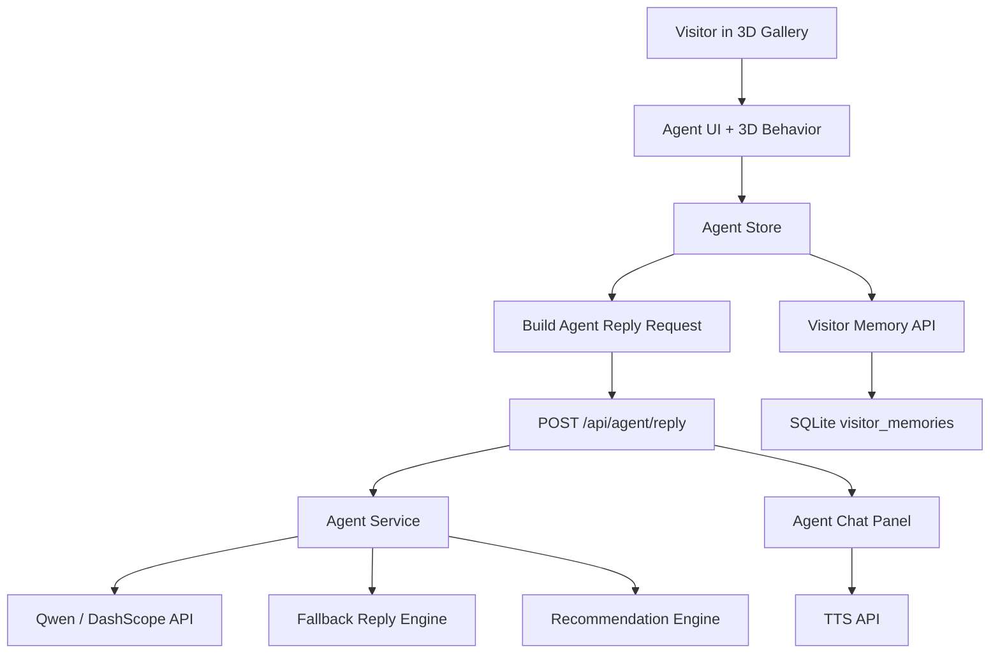

# AI Agent Implementation Plan

## 1. Objective

The project should position its main feature as a **spatially aware AI exhibition guide**.

The AI Agent is not only a chat assistant. It should behave like a virtual guide inside the 3D gallery: it understands the visitor's position, the nearby exhibit, viewing history, dwell time, interaction records, preferred language, and selected guide personality. Based on that context, it can explain artworks, recommend the next exhibit, follow the visitor, and support guided tour flows.

## 2. Current Implementation Baseline

The project already includes a strong foundation for the AI Agent:

- 3D Agent state and behavior modes: `idle`, `follow`, `guide`, `tour`, `wander`, `answer`
- Agent participation mode: `solo` or `ai`
- Three guide personalities: beginner-friendly, expert, humorous
- Context-aware chat request payloads
- Qwen / DashScope-backed AI response generation
- Fallback responses when the AI API is unavailable
- Exhibit context injection
- Nearby exhibit context
- Chat history
- Visitor memory persistence
- Dwell-time tracking data model
- Smart exhibit recommendation logic
- TTS response playback

Key files:

- `src/app/modules/metaverse3d/agent/types.ts`
- `src/app/modules/metaverse3d/agent/agentBehaviors.ts`
- `src/app/modules/metaverse3d/agent/useAgentBehavior.ts`
- `src/app/modules/metaverse3d/components/UI/AgentChatPanel.tsx`
- `src/app/modules/metaverse3d/components/UI/AgentModeSelector.tsx`
- `server/services/agentService.js`
- `server/routes/agentRoutes.js`
- `server/routes/visitorMemoryRoutes.js`

## 3. Target User Experience

### 3.1 Entry Flow

When a visitor enters a 3D exhibition, the system presents two options:

- Explore independently
- Start AI guided tour

If the visitor chooses AI guided tour, the Agent appears in the scene, opens the guide panel, introduces itself, and suggests the first exhibit.

### 3.2 Spatial Guidance

The Agent follows or guides the visitor through the gallery. When the visitor approaches an exhibit, the Agent detects the nearby exhibit and updates the active context.

The Agent should be able to:

- Stand near the relevant exhibit
- Follow the visitor at a comfortable distance
- Move toward the next recommended exhibit
- Avoid leaving gallery bounds
- Avoid walking through walls where floor-plan data is available

### 3.3 Contextual Explanation

When the visitor asks a question, the Agent sends the following context to the backend:

- Current question
- Selected personality
- Current exhibit
- Nearby exhibits
- Recent chat history
- Visitor position
- Viewing mode
- Follow state
- Visited exhibit IDs
- Engaged exhibit IDs
- Dwell seconds by exhibit
- Last recommended exhibit
- Preferred language
- Session ID
- User answer preferences

The backend uses this context to generate a response through Qwen / DashScope. If no API key is configured or the request fails, the backend returns a deterministic fallback response.

### 3.4 Personalized Recommendations

The Agent recommends the next exhibit based on:

- Whether the exhibit has not been visited
- Whether the exhibit has not been engaged with
- Whether the exhibit has the same type as the current exhibit
- Dwell time signals
- Whether the exhibit was already recommended last time

The recommendation must include a human-readable reason.

### 3.5 Continuous Tour Mode

Tour mode should become a complete guided journey, not only movement logic.

The Agent should:

1. Select a route from available exhibits.
2. Move to the next exhibit.
3. Announce the current stop.
4. Explain the exhibit.
5. Ask if the visitor wants to continue.
6. Recommend or move to the next stop.

## 4. Architecture



## 5. Data Contracts

### 5.1 Agent Reply Request

Endpoint:

```http
POST /api/agent/reply
```

Required:

```ts
{
  question: string;
  personality: "xiaobai" | "expert" | "humor";
}
```

Optional context:

```ts
{
  exhibit?: AgentSceneExhibitPayload | null;
  nearbyExhibits?: AgentSceneExhibitPayload[];
  chatHistory?: AgentChatHistoryPayload[];
  visitorState?: AgentVisitorStatePayload;
  sessionState?: AgentSessionStatePayload | null;
  userPreferences?: AgentUserPreferencesPayload | null;
}
```

Response:

```ts
{
  answer: string;
  source: "qwen" | "fallback";
  recommendedExhibit: {
    id: string;
    title: string;
    reason: string;
  } | null;
}
```

### 5.2 Visitor Memory

Endpoint:

```http
GET /api/visitor-memory/:galleryId
PUT /api/visitor-memory/:galleryId
```

Stored memory:

```ts
{
  visitedExhibitIds: string[];
  engagedExhibitIds: string[];
  dwellSecondsByExhibit: Record<string, number>;
  preferredPersonality?: string;
  preferredLanguage?: string;
}
```

## 6. Implementation Phases

### Phase 1: Clean Agent-Facing Text

Goal: make the AI Agent presentable as the project's main feature.

Tasks:

- Fix garbled Traditional Chinese text in Agent UI.
- Fix garbled Traditional Chinese text in `agentService.js`.
- Replace unclear quick prompts with polished prompts.
- Ensure fallback responses are readable in Traditional Chinese and English.
- Review Agent labels, buttons, empty states, loading states, and error messages.

Acceptance criteria:

- Agent panel contains no garbled text.
- Fallback answers are readable.
- Personality labels and descriptions are clear.

### Phase 2: Strengthen Guided Tour Flow

Goal: make `tour` mode feel like a real AI-guided journey.

Tasks:

- Add explicit tour session state to the Agent store.
- Track current tour stop index and total stops.
- Generate a route from available exhibits.
- When the Agent reaches a stop, trigger an AI explanation.
- Add UI for current stop progress.
- Add actions for next stop, pause tour, and end tour.

Acceptance criteria:

- Visitor can start a guided tour.
- Agent moves to the first exhibit.
- Agent explains the exhibit after arriving.
- UI shows current tour progress.
- Visitor can continue to the next stop.

### Phase 3: Improve Recommendation UX

Goal: make recommendations understandable and visible.

Tasks:

- Show recommendation reason in natural language.
- Show which signal influenced the recommendation, such as unvisited, similar type, or long dwell time.
- Add a button to move toward or open the recommended exhibit.
- Persist `lastRecommendedExhibitId`.
- Avoid recommending the same item repeatedly.

Acceptance criteria:

- Recommendation card clearly explains why the exhibit is recommended.
- Recommendation changes after the visitor follows or dismisses it.
- Repeated recommendations are reduced.

### Phase 4: Persist Visitor Preferences

Goal: make the Agent feel personal across sessions.

Tasks:

- Load visitor memory when entering a gallery.
- Save visited exhibits, engaged exhibits, dwell time, preferred language, and preferred personality.
- Add a "reset AI memory" control.
- Add safe failure behavior if memory loading or saving fails.

Acceptance criteria:

- Returning visitors keep their language and personality preferences.
- Returning visitors do not receive the exact same first recommendation when prior memory exists.
- Memory failure does not break gallery navigation.

### Phase 5: Agent Insight Panel

Goal: make the Agent's intelligence visible to evaluators and users.

Tasks:

- Add a compact Agent insight panel.
- Show visited count.
- Show most-viewed exhibit.
- Show current personality.
- Show current guide mode.
- Show recommended next exhibit.
- Show response source: `qwen` or `fallback`.

Acceptance criteria:

- Evaluators can quickly see that the Agent uses behavior and memory signals.
- The panel does not block the 3D experience.

### Phase 6: Testing and Evaluation

Goal: protect the Agent behavior from regressions.

Tasks:

- Add tests for prompt construction.
- Add tests for fallback replies in Traditional Chinese and English.
- Add tests for recommendation scoring.
- Add tests for visitor memory load/save behavior.
- Add tests for tour state transitions.
- Add UI tests for Agent panel states.

Acceptance criteria:

- `npm run check` passes.
- Recommendation tests cover visited, unvisited, same-type, dwell-time, and repeated recommendation cases.
- Fallback behavior is tested without API keys.

## 7. Prompting Strategy

The system prompt should enforce:

- Answer only from provided exhibit data.
- Do not fabricate author, date, background, or facts.
- Use the selected language.
- Match selected personality.
- Keep response length appropriate.
- Prefer natural guide language over report-like formatting.
- Include recommendation context when relevant.

The user payload should remain structured JSON so the model can distinguish:

- User question
- Current exhibit
- Nearby exhibits
- Visitor memory
- Session state
- Recommendation

## 8. Fallback Strategy

Fallback responses are required for demo reliability.

Fallback should support:

- Artwork introduction
- Artist question
- Generic exhibit question
- Nearby exhibit recommendation
- Empty or invalid input

Fallback should not pretend to be AI-generated. The UI can show the `FALLBACK` source badge.

## 9. Testing Strategy

### Unit Tests

- Recommendation scoring
- Fallback generation
- Prompt construction
- Request payload serialization
- Visitor memory normalization

### Integration Tests

- `POST /api/agent/reply`
- `GET /api/visitor-memory/:galleryId`
- `PUT /api/visitor-memory/:galleryId`
- TTS failure handling

### UI Tests

- Select AI guide mode
- Switch personalities
- Ask a question
- Display recommendation
- Display response source
- Toggle language

### Manual Demo Checklist

- Start app and backend.
- Register or log in.
- Create or open a gallery with multiple exhibits.
- Choose AI guided tour.
- Walk near an exhibit.
- Ask for an introduction.
- Switch personality.
- Verify recommendation.
- Reload gallery and verify memory.
- Disable API key and verify fallback response.

## 10. Risks and Mitigations

### Risk: AI responses hallucinate

Mitigation:

- Keep exhibit context structured.
- Add strict system prompt rules.
- Show fallback for unavailable data.
- Add tests for missing author/date cases.

### Risk: Agent feels like a normal chatbot

Mitigation:

- Lead with spatial guidance.
- Show movement, active exhibit, and recommendation state.
- Add guided tour progress.
- Make memory signals visible.

### Risk: TTS slows down the experience

Mitigation:

- Treat TTS as optional.
- Never block text response on audio playback.
- Show speaking state separately.

### Risk: Visitor memory creates privacy concerns

Mitigation:

- Store only minimal interaction data.
- Add memory reset.
- Avoid sensitive data in logs or URLs.

### Risk: 3D movement gets stuck

Mitigation:

- Keep movement bounded.
- Add escape fallback to idle mode.
- Test tour state transitions.

## 11. Definition of Done

The AI Agent implementation is considered ready for main-feature presentation when:

- The Agent UI contains no garbled text.
- The Agent can enter AI guided tour mode.
- The Agent can explain the current exhibit.
- The Agent can recommend the next exhibit with a clear reason.
- The Agent uses visitor memory across sessions.
- The Agent can switch personalities.
- The Agent has reliable fallback behavior.
- The Agent can optionally speak responses through TTS.
- `npm run check` passes.
- The demo script can be completed without manual database edits or code changes.

