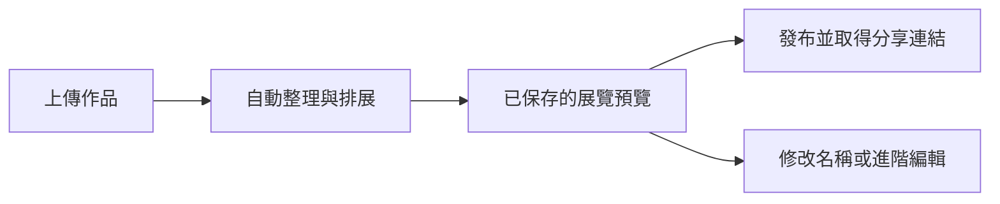
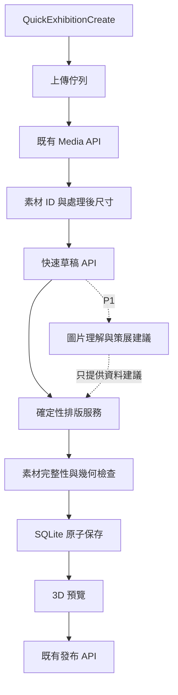

# 上傳即建展 Implementation Plan

> **For Claude:** REQUIRED SUB-SKILL: Use superpowers:executing-plans to implement this plan task-by-task.

**Goal:** 讓已登入用戶只需批量上傳圖片，系統便自動建立、保存及展示可參觀的展覽草稿，由用戶預覽後發布。

**Architecture:** 新增獨立的快速建展入口，重用既有媒體上傳、展覽保存、場景格式及 3D 查看功能。第一期以確定性排版完成整條流程；第二期加入圖片理解及 AI 策展。作品身分、檔案來源、數量及幾何配置由程式保證，AI 提供可修改的策展建議。

**Tech Stack:** React 18、TypeScript、React Router、Tailwind v4、shadcn/Radix、Zustand、React Three Fiber、Three.js、Express ESM、SQLite、Zod、Sharp、Vitest；第二期沿用 Qwen / DashScope。

---

## 1. 文件狀態與範圍

- 日期：2026-09-02。
- 狀態：P0 功能已實作，完整程式檢查及主要瀏覽器驗證通過；真實公開發布的手動驗證待授權。執行差異與驗收結果見第 15 節。P1／P2 保持獨立交付。
- 基準：本機工作目錄的現有程式，包含尚未提交的功能。歷史設計文件只作背景，API 與行為以目前程式為準。
- 路徑基準：下文程式路徑均相對於 `D:/meta_exb/web_ui_new/`；所有 npm 指令在該目錄執行。
- 頁首執行技能名稱沿用專案計畫模板；實際執行遵循當時可用工具及使用者指示，不以未安裝技能作為工作阻礙。
- 第一期以下簡稱 P0，第二期為 P1，後續擴充為 P2。P0 全部驗收通過才視為「上傳即建展」完成。

## 2. 產品目標

### 2.1 核心體驗

正常流程只要求用戶選擇作品，不要求先填主題、選模板、設定房間尺寸、撰寫提示詞或操作 3D 編輯器。



「自動完成」的界線是產生可預覽的私人草稿。公開發布仍由用戶按下「發布展覽」。

### 2.2 P0 成功標準

1. 已登入用戶選擇 1–30 件有效圖片後，不需要再按「下一步」或「開始 AI 排展」，即可到達展覽預覽。
2. 所有本次確認納入的作品各展示一次；不能截斷清單、替換成示範圖片或捏造作者。
3. 草稿已在伺服器保存，重新整理後仍能恢復作品及結果。
4. 正常流程在檔案選擇完成至預覽之間，必要的文字輸入及額外按鈕操作均為 0。
5. 不依賴 AI 服務可用性；P0 不呼叫模型也能完成。
6. 上傳失敗、瀏覽器不支援 3D 或發生版本衝突時，保留已完成工作，指出可執行的下一步。

## 3. 現有能力與缺口

以下為已確認的程式現況，不代表新增功能已完成。

| 項目 | 現有位置 | 現況與本計畫的處理 |
| --- | --- | --- |
| 六步建展精靈 | `src/app/features/exhibition-wizard/ExhibitionWizard.tsx`、`wizardStore.ts` | 主題、作品、風格、排展、預覽、發布依序進行，主題及風格必填；快速入口採用新的簡化流程 |
| 批量上傳 | `src/app/features/exhibition-wizard/steps/UploadStep.tsx` | 支援靜態 JPEG、PNG、WebP，多檔使用 `Promise.all`；抽出可控併發及逐檔狀態處理 |
| 作品資料匯入 | `src/app/features/exhibition-wizard/import/` | 已能按檔名配對作品資料；快速流程不將資料表匯入設為必填 |
| 媒體儲存及權限 | `server/routes/mediaRoutes.js`、`server/repositories/mediaRepository.js` | 已有素材 ID、擁有人、展覽綁定、暫時預覽 URL；延用這套身分及存取方式 |
| 圖片處理 | `server/services/mediaMetadataService.js`、`mediaIngestService.js` | PNG/WebP 已取得處理後寬高，但上傳回應及資料庫未保存；JPEG 現行流程移除 APP1，須補解碼、方向校正及一致的尺寸資料 |
| 精靈排展 | `src/app/pages/VirtualGalleryCreate.tsx` 的 `handleWizardLayout` | 展品數量被限制在 30；將清單交給生成服務後直接匯入編輯器，尚無完整的素材逐項核對 |
| 生成服務 | `server/services/exhibitionSceneService.js` | 已有 AI 文字策展及固定排版後備方案；目前模型輸入是文字 JSON，網址出現在文字中，不是圖片理解輸入 |
| 場景幾何 | `server/services/sceneGeometryService.js` | 有貼牆、接地等校正；其部分高度預設與前端尺度不同，不能在排版後無條件重設作品位置 |
| AI 自我檢查 | `src/app/modules/metaverse3d/aiBuilder/`、`server/services/exhibitionBuilderAgentService.js` | 有截圖、審查、有限次修訂及版本保存；P1 再接入，P0 不等待這條迴圈 |
| 展覽保存與發布 | `server/routes/galleryRoutes.js`、`src/app/api/gallery.ts` | 已有私人草稿與發布 API；新增快速草稿協調層，沿用正式展覽記錄 |
| 3D 與效能 | `src/app/features/metaverse-studio/`、`src/app/modules/metaverse3d/performance/sceneBudget.ts` | 可重用場景渲染及負載分析；上傳頁延遲載入 3D，預覽按實際作品顯示 |

關鍵差異：已有「作品上傳」和「自動排展」不等於已有「上傳後能自動保存、恢復及發布的完整流程」。本計畫補齊兩者之間的協調。

## 4. 分期決策

| 能力 | P0：上傳即建展 | P1：智慧策展 | P2：擴充 |
| --- | --- | --- | --- |
| 檔案格式 | 靜態 JPG、PNG、WebP | 同 P0 | 影片、PDF、3D 模型，分別設計展示方式 |
| 展品容量 | 每展 1–30 件，超限在上傳前明確處理 | 維持已驗證容量 | 自動分廳與分段載入，驗證後提高上限 |
| 展覽名稱 | 選填；預設「我的作品展」並按語言顯示 | 根據作品建議展名 | 多語版本與系列展 |
| 風格 | 自動採用白盒展廳 | 可選白盒、暖色博物館等既有風格 | 更多空間主題 |
| 作品標題 | 使用者輸入優先，否則去除副檔名 | 產生可修改的建議 | 依匯入規則或館藏資料配對 |
| 作者與作品史實 | 已提供才使用，未知留空 | 同 P0；模型不得補造 | 接入可信資料來源後另行處理 |
| 排列 | 上傳選擇順序、依比例配置四面牆 | 題材／色彩分組與觀展順序 | 多展廳、局部增補 |
| 保存與重試 | 伺服器草稿、逐檔重試、重複請求防護 | 背景 AI 任務及取消／恢復 | 更大批次與多裝置協調 |
| 修改已手動編輯場景 | 透過進階編輯器處理 | 先預覽風格及策展變更 | 新增作品時保留手動位置，局部安排 |

P0 的容量限制是一項明確的首版產品決策，不代表引擎已具備 30 件以上自動分廳能力。超過上限時顯示實際件數及可用選項，不默默只取前 30 件。第一期先不引入 ZIP 解壓、資料夾遞迴或新上傳基礎設施。

## 5. 用戶流程與畫面

### 5.1 入口

- 新增受 `RequireAuth` 保護的 `/virtual-gallery/quick-create`。
- 首頁及「我的展覽」主要建立操作連到此入口，文字為「上傳作品建展」。
- 原有 `/virtual-gallery/create` 繼續承接現有展覽、模板、分享及進階編輯。
- 登入在選檔前完成；瀏覽器重新整理後無法恢復尚未上傳的本機 `File`，不能承諾任意檔案自動續傳。

### 5.2 上傳畫面

```text
上傳作品，即可建立你的展覽
系統會自動安排作品位置、展廳及燈光。

[ 將作品拖到這裡，或選擇圖片 ]
JPG、PNG、WebP · 最多 30 件 · 每件大小限制依伺服器設定

[縮圖] 海邊.jpg        已上傳
[縮圖] 夜色.png        上傳中
[縮圖] 街角.webp       等待中

展覽名稱（選填） [ 我的作品展 ]
```

- 上傳區必須同時支援點擊／鍵盤選檔及拖放，手機不依賴拖放。
- 用 `clientFileId` 管理本機項目；顯示順序不得依上傳完成快慢改變。
- 每批成功完成、沒有等待／失敗檔案、清單已保存後，自動開始一次排展。
- 上傳期間可追加批次；短暫的排版／保存期間鎖定清單與展名，完成後可繼續管理作品。跨分頁修改仍以 revision 防止舊結果覆蓋新清單。
- 上傳期間完成數可準確顯示；現有介面沒有位元組進度時，不顯示假百分比。
- 失敗項目提供「重試」和「移除」。只有用戶明確選擇排除失敗項目，才可用其餘作品繼續。

### 5.3 建展進度

P0 顯示「上傳作品」「整理尺寸」「安排展廳」「保存展覽」「準備預覽」。其中同步請求內的步驟不一定能逐一從前端觀察，這時顯示一個「正在安排並保存展覽」階段，不能用計時器假裝後端進度。

上傳完成至第一個可互動預覽的時間須實測；初始改善目標為一般開發設備上，排版及保存不超過 5 秒，不包含上傳、圖片下載及 3D 首次載入。這是待驗證目標，不是現有量測結果或對外承諾。

### 5.4 結果畫面

- 預設以訪客模式呈現實際展覽，顯示「已展示 12 / 12 件作品」「草稿已保存」。
- 主要操作：「發布展覽」；次要操作：「修改名稱」「管理作品」「進階編輯」。
- P0「管理作品」返回快速草稿清單；清單變更會建立新的預覽版本。已經手動編輯的場景不自動覆寫。
- 首次生成是空草稿，可直接保存；已有完成版本時，重新排展先保存候選，讓用戶選擇套用或保留原版。
- 3D 載入失敗時提供實際作品的 2D 清單及重試，不能將「資料已生成」顯示成「3D 已成功預覽」。
- 發布成功後使用既有公開展覽頁及分享連結。
- 發布後重新編排需另建私人候選，套用時走明確更新流程；P0 快速建展不直接修改已公開展覽。

## 6. 架構與責任



### 6.1 前端模組

新增 `src/app/features/quick-exhibition/`，頁面 `src/app/pages/QuickExhibitionCreate.tsx` 只負責路由、登入狀態及組合功能。

- `types.ts`：素材、草稿、結果與流程型別。
- `quickExhibitionState.ts`：純狀態轉換及是否可自動建展的判斷。
- `uploadQueue.ts`：沿用 `uploadMediaAsset`，預設同時上傳 3 件，可調常數集中管理。
- `useQuickExhibition.ts`：協調上傳、草稿同步、建展、取消本機等待、恢復與重試。
- `QuickUploadPanel.tsx`、`QuickBuildProgress.tsx`、`QuickExhibitionPreview.tsx`：畫面。
- `index.ts`：功能公共入口；外部只透過 facade 使用。
- 新增 `src/app/api/quickExhibition.ts`，沿用現有請求及錯誤處理工具。

從 `UploadStep.tsx` 抽出的上傳機制可供兩種流程共用。既有六步精靈先保留其流程規則，不直接改寫其 draft v1 以免破壞恢復行為。

### 6.2 後端模組

- `server/routes/quickExhibitionRoutes.js`：請求驗證、登入及擁有人檢查。
- `server/services/quickExhibitionService.js`：草稿建立、素材解析、排版、候選結果、保存協調。
- `server/services/automaticExhibitionLayout.js`：純排版及完整性檢查，不呼叫模型、不依賴瀏覽器。
- `server/repositories/quickExhibitionRepository.js`：快速草稿的版本、結果及交易操作。
- `server/index.js` 註冊路由，`server/config/deps.js` 注入依賴。

正式展覽仍存在 `galleries`；`quick_exhibition_drafts` 只保存建展過程及作品清單，不另建一套發布系統。P0 排版為短同步請求，不新增 Redis、工作佇列服務或常駐排程。

## 7. 資料契約與持久化

以下名稱為新增介面的設計，尚未存在於程式中。

### 7.1 素材及場景

```ts
type QuickExhibitionAsset = {
  clientFileId: string;
  assetId: string;
  order: number;
  fileName: string;
  mimeType: 'image/jpeg' | 'image/png' | 'image/webp';
  width: number;
  height: number;
  title: string;
  artist: string;
  description: string;
};

type QuickExhibitionInput = {
  title?: string;
  language: 'zh-TW' | 'zh-CN' | 'en';
  style: 'white-box';
  assets: QuickExhibitionAsset[];
};
```

- 用戶端只提交 `assetId`、排序及可編輯文字；寬高、MIME、檔案來源由伺服器查詢，不信任客戶端自報值。
- `media_assets` 新增可為空的 `width`、`height`。新圖片必須取得有效尺寸，舊素材於第一次使用時讀取檔案補足，無法解碼便回傳具體錯誤。
- `mediaIngestService` 傳回最終儲存圖片的尺寸；`UploadedMediaAsset` 型別與資料庫保持一致。
- 場景作品使用現有 `assetId`；`id` 可穩定地由素材 ID 派生，例如 `artwork-${assetId}`。
- 場景 `content`／`assetUrl` 保存 `/api/media/<assetId>`，不保存暫時 `accessToken`、分享憑證或 `blob:` URL。
- 新增可選正數欄位 `imageAspectRatio`，同步修改 `ExhibitItem` 型別、伺服器 scene schema、繪製及往返保存測試；舊場景缺少時延用現有行為。
- 暫時預覽 URL 只在顯示層加上，恢復草稿時重新簽發。已取得素材 ID 不表示有權讀取該素材，仍須查 owner、usage 及 gallery 綁定。

### 7.2 快速草稿

新增 `quick_exhibition_drafts`：

| 欄位 | 用途 |
| --- | --- |
| `id` | 用戶端產生並放入 URL 的草稿 UUID，作為建立重試依據 |
| `owner_id` | 擁有人 |
| `gallery_id` | 綁定正式私人展覽，唯一 |
| `revision` | 整數版本；作品清單、設定、候選結果或套用狀態變動時遞增 |
| `input_json` | 已持久化素材清單、順序與設定；不得包含本機 File 或暫時 URL |
| `status` | `collecting`、`ready`、`candidate_ready`、`failed`、`published` |
| `base_scene_hash` | 最近由快速建展成功保存／套用的正式場景雜湊，用來辨認外部修改；新草稿為初始空場景雜湊 |
| `result_json` | 候選場景、作品清單、檢查摘要及排版版本；限制大小 |
| `applied_input_json`、`applied_result_json` | 上一次已套用版本的清單與結果；放棄候選時完整恢復 |
| `editor_managed_at` | 進階編輯器首次保存後標記接管；舊快速請求不能覆蓋手動場景 |
| `last_request_id`、`last_request_fingerprint` | 最近成功建展／套用請求的重複辨識 |
| `error_code` | 可恢復的錯誤代碼，不存敏感原始堆疊 |
| `created_at`、`updated_at` | 建立與更新時間 |

交易建立 `galleries` 與快速草稿，保證同一草稿 ID 重試不會多建展覽。新資料表及欄位採可重複執行的增量 migration；不刪除或重建現有資料庫。

待上傳／失敗的本機項目另存在按用戶與草稿分隔的 session 狀態。伺服器只保存已完成的素材；重新整理後失去檔案物件時，明確標示需要重新選檔，不能偷偷排除原本未完成的項目。

## 8. API 設計

| API | 行為 |
| --- | --- |
| `PUT /api/quick-exhibitions/:draftId` | 首次有效選檔後建立草稿；同擁有人重試回傳原有草稿，不覆寫內容 |
| `GET /api/quick-exhibitions/:draftId` | 恢復草稿、版本、已上傳素材及結果，回傳新預覽 URL |
| `PATCH /api/quick-exhibitions/:draftId` | 以 `expectedRevision` 更新作品清單或設定；驗證並綁定素材 |
| `POST /api/quick-exhibitions/:draftId/build` | 以伺服器草稿排版；首次生成自動保存，之後生成候選 |
| `POST /api/quick-exhibitions/:draftId/apply` | 明確套用候選；檢查草稿版本、場景雜湊、私人狀態 |
| `POST /api/quick-exhibitions/:draftId/discard` | 放棄候選，恢復上一次套用的清單及結果；不重寫正式場景 |
| 既有 `POST /api/galleries/:id/publish` | 發布已保存且通過核對的快速展覽 |

`build` 請求：

```json
{
  "requestId": "<UUID>",
  "expectedRevision": 4
}
```

成功回應的關鍵欄位：

```json
{
  "draftId": "<UUID>",
  "galleryId": "<既有 gallery ID>",
  "revision": 5,
  "status": "ready",
  "result": {
    "layoutVersion": 1,
    "includedAssetIds": ["<asset UUID>"],
    "uploadedCount": 1,
    "placedCount": 1,
    "warnings": []
  }
}
```

完整場景沿用 `SceneSnapshot` 契約。回應中的成功件數由伺服器核對後產生。

### 8.1 驗證及錯誤

- `401`：需要登入。
- `404`：草稿／素材不存在或不屬於該用戶，沿用既有不暴露他人資料的方式。
- `409 DRAFT_CHANGED`：清單版本已變；重新讀取再計畫，不強制覆寫。
- `409 SCENE_CHANGED`：其他分頁或進階編輯器已修改場景；保留最新場景及候選。
- `409 REQUEST_ID_REUSED`：相同請求 ID 對應不同輸入；不視為安全重試。
- `409 DRAFT_EDITOR_MANAGED`：已由進階編輯器接管，回傳擁有權確認後的 `galleryId`，介面引導到該展覽繼續編輯／發布。
- 上傳 `429`：保留成功項目，顯示稍後重試提示；預設每十分鐘 60 次，可用既有環境設定覆寫。
- `422 EMPTY_EXHIBITION`、`TOO_MANY_ASSETS`、`ASSET_DIMENSIONS_UNAVAILABLE`、`ASSET_COVERAGE_MISMATCH`、`LAYOUT_NOT_POSSIBLE`：可修正的輸入或排版問題。
- 原有上傳 `413` 及 `INVALID_UPLOAD` 沿用；新介面讀取同一組大小與格式限制。

### 8.2 保存順序與競爭條件

1. 讀取草稿版本、擁有人、綁定素材及正式展覽場景。正式場景須符合已保存的 `base_scene_hash`；不符合表示已被其他流程修改，回傳 `SCENE_CHANGED`，不能把新場景直接當成可覆寫基準。
2. 固定本次輸入快照與請求 fingerprint；在資料庫交易外完成純排版。
3. 核對素材完整性、尺寸、通道及 scene schema。
4. 以資料庫交易重新核對 `revision`、是否已發布、正式場景及素材仍有效。
5. 首次生成：同一交易寫入正式場景、更新 `base_scene_hash`、草稿結果、請求記錄及新版本。候選生成：只寫快速草稿結果，不改正式場景或基準雜湊；明確套用成功時才一起更新基準。
6. 交易成功後才回報 `ready` 或 `candidate_ready`。回應遺失時 GET 草稿即可恢復。
7. 相同最新請求 ID 及 fingerprint 重試，回傳已保存結果；舊版本或過期請求回傳 409，不再生成或另建展覽。

SQLite 交易必須使用專用連線或既有可靠的交易封裝，避免在共用連線上以多次非同步呼叫拼出可被其他請求插入的 `BEGIN/COMMIT`。正式場景比較與更新需在同一交易，不能只在前端比較時間戳。雜湊由伺服器針對已保存的正式場景計算，絕不採信前端提供的場景雜湊。

發布時，快速草稿關聯的展覽必須確認目前已保存版本完整且沒有未套用的清單變更。伺服器 gate 只作用於快速草稿，避免讓既有手工展覽誤受新流程限制。

經既有進階編輯路由授權保存場景時，在同一交易保存正式場景並標記接管。此後發布走既有手工展覽流程，快速讀取／生成／套用則回傳 `DRAFT_EDITOR_MANAGED`，避免永久卡住手動修改過的展覽。

## 9. 自動排版規則

### 9.1 P0 空間策略

- 使用一個白盒房間，依四面牆的可用牆長擴展房間尺寸，仍遵守既有 scene schema 邊界。
- 入口保留區及轉角保留區不放作品；作品沿牆安排，不使用中央障礙物裝飾。
- 作品順序穩定，預設依 `order`，不因網路速度或重試改變。
- 採用既有畫框視覺及共用照明，避免每件作品新增獨立即時陰影燈。
- 若容量不足，按固定候選房間尺寸由小至大嘗試；全部不適用才回報排版失敗，不能靠重疊或把作品縮得無法閱讀來完成。

### 9.2 比例與尺寸

圖片方向校正後，以 `r = width / height` 計算顯示比例。以下為圖片平面的純計算範例，不包含畫框厚度：

```ts
export function fitImageWithin(
  width: number,
  height: number,
  maxWidth: number,
  maxHeight: number,
): { width: number; height: number } {
  if (![width, height, maxWidth, maxHeight].every((value) => Number.isFinite(value) && value > 0)) {
    throw new Error('Invalid image or display bounds');
  }
  const factor = Math.min(maxWidth / width, maxHeight / height);
  return { width: width * factor, height: height * factor };
}
```

- 初始圖片顯示區上限為 2.4 × 1.8 場景單位，這是待實際視覺驗證的設計值。
- 畫框可以有最小外框尺寸；超長或超窄作品在框內保留留白，圖片本身不拉伸、不裁切。
- 繪製層按 `imageAspectRatio` 算圖片平面，不把紋理無條件拉滿整個框。
- 作品中心優先沿用 `DEFAULT_ARTWORK_CENTER_HEIGHT`，目前值為 1.55；佈局及驗證需使用一致的空間尺度。
- 不能在新排版後直接呼叫會把中心高度設為 2.5 的舊校正行為。增加明確的排版設定或獨立驗證模式，保留舊場景相容性。
- 沿用牆面內縮概念，並以完整框體厚度檢查牆面穿插。

### 9.3 初始幾何驗收值

作品外框之間至少 0.5 單位，距離牆角至少 0.6 單位；入口及主要通道至少 1.2 單位。這些是虛擬展廳的初始產品設計值，不作為實體建築或無障礙法規認證。

排版演算法須檢查框體包圍盒，而不是只檢查作品中心點。展牌空間也要列入佔用區；必要時以點擊作品顯示詳細說明，避免長文展牌塞滿牆面。

### 9.4 作品完整性

完整性必須以穩定素材 ID 核對，不只比較總數：

```ts
export function assertAssetCoverage(
  expectedIds: string[],
  placedIds: string[],
): void {
  const expected = new Set(expectedIds);
  const placed = new Set(placedIds);
  const duplicateInput = expected.size !== expectedIds.length;
  const duplicatePlacement = placed.size !== placedIds.length;
  const mismatch = expected.size !== placed.size
    || [...expected].some((id) => !placed.has(id));
  if (duplicateInput || duplicatePlacement || mismatch) {
    throw new Error('ASSET_COVERAGE_MISMATCH');
  }
}
```

核對對象僅為上傳展品，排除場景中的標題文字及裝飾。再逐項確認 `content` 指向該 `assetId` 的正式 URL，防止 ID 正確但圖片來源被換掉。缺圖時顯示該作品的載入失敗狀態，不能用無關照片代替。

## 10. 上傳、恢復及使用者修改

| 情況 | 行為 |
| --- | --- |
| 其中 1 件上傳失敗 | 其餘作品留存；提供單件重試／移除，暫停自動建展 |
| 1 件素材回應遺失 | 保留明確的未知狀態；重試上傳可能建立新素材，清單只綁定確認成功的一個 ID，未綁定檔案沿用清理機制 |
| 建展 HTTP 回應遺失 | GET 草稿確認版本；已完成則直接顯示，未完成以相同請求 ID 重試 |
| 上傳中重新整理 | 已保存素材從伺服器恢復，未完成本機檔案需要重新選擇 |
| 快速連續選取兩批檔案 | 各檔合併進最新狀態，佇列及草稿更新序列化，不以過期閉包覆蓋另一批 |
| 建展中追加／移除作品 | P0 短請求期間停用清單操作；排版完成後可追加／移除；其他分頁的過期提交由 revision 拒絕 |
| 離開頁面 | 停止前端更新並釋放本機縮圖；已保存草稿仍保留，伺服器短請求可能已完成 |
| 刪除清單項目 | 移出本草稿；若已被正式／候選版本引用，不直接物理刪除素材，沿用有引用意識的清理流程 |
| 相同檔名、不同圖片 | 視為不同作品，以 ID 分辨，不能按檔名自動去重 |
| 不同分頁或專業編輯器修改 | 以版本及場景比較拒絕舊提交，保留雙方結果 |
| 沒有 WebGL | 展示作品清單與草稿狀態，允許稍後再進行 3D 預覽 |

前端流程狀態可為 `empty → uploading → building → preview → publishing → published`，另有 `needs_attention`。資料庫保存穩定狀態，短暫的網路請求狀態不偽裝成可永久恢復的背景任務。

## 11. 第二期：圖片理解與智慧策展

P1 在 P0 全流程成立後實現。Qwen 圖片理解需傳送實際圖片輸入，而不是把 URL 放進文字 JSON；參考 [Qwen 圖片理解官方文件](https://www.alibabacloud.com/help/en/model-studio/vision/)。模型及參數在實作時依已配置環境核實。

1. 由伺服器依已授權素材 ID 讀取檔案，建立縮小預覽，再提交圖片理解。不可要求外部模型讀取 `localhost` 或公開私人媒體來讓模型存取。
2. 建議輸出欄位：`assetId`、可見內容摘要、題材標籤、主色、建議標題。模型回傳的每個素材 ID 都需與輸入核對。
3. 由策展服務產生展覽名稱、展區及作品順序；排版仍使用確定性引擎。
4. 作者、年份、真實地點及作品背景沿用已提供資料。圖片不能支持的資訊留空；生成介紹在編輯介面標示為建議。
5. 素材不完整、模型逾時或輸出無效時，直接採用 P0 預設，保留所有作品，避免阻塞建展。
6. 每素材分析結果可按擁有人、內容雜湊及分析版本快取；避免同一作品在重新排版時重複付費。
7. P1 才加入持久化背景任務及真實進度／取消。現有 Builder session 保存的是生成版本，不能直接視為可恢復的後端工作佇列。
8. 3D 視覺檢查沿用既有截圖／審查模組，受次數及時間上限控制；失敗不丟棄已可用的 P0 草稿。
9. 用戶端移走或切換場景後，舊截圖／AI 建議不得套入新草稿。

在圖片提交外部模型的功能入口提供清楚的處理說明，沿用專案資料處理設定；P0 無需外部圖片分析。

P2 才處理 30 件以上自動分廳、背景批量轉檔、增補展品不搬動原作品，以及任意已編輯場景的局部重排。這些功能需要獨立的空間與版本策略，不能只調高陣列上限。

## 12. 實現工作拆分

以下任務依依賴順序執行。先以有意義的失敗案例固定行為，再實現與驗證；純文案、樣式或逐字鏡像的測試不必新增。每個任務完成後只檢查該任務的變更，提交時包含專案要求的實際模型 attribution，不能把既有未提交工作一起加入。

### Task 1：補齊可信圖片尺寸與方向

**修改：** `server/services/mediaMetadataService.js`、`server/services/mediaIngestService.js`、`server/repositories/mediaRepository.js`、`server/routes/mediaRoutes.js`、`server/db.js`、`src/app/api/media.ts`。

**測試：** 現有 `mediaMetadataService.test.js`、`mediaIngestService.test.js`、`mediaRoutes.test.js`、`mediaAssetsDb.test.js`、`dbInitialization.test.js`。

1. 加入橫向、直向、EXIF 旋轉 JPEG、PNG、WebP 及非法內容案例，斷言保存後的實際像素方向及尺寸。
2. 以既有 Sharp 依賴解碼、先修正方向再清理 metadata；讓三種格式遵守相同像素／長邊限制。
3. 保存處理後寬高，讓上傳、讀取及恢復素材回傳相同尺寸。
4. 驗證 migration 可對既有資料庫重複執行，舊素材空尺寸可按需補足。
5. 執行：`npm run test -- server/services/mediaMetadataService.test.js server/services/mediaIngestService.test.js server/routes/mediaRoutes.test.js server/mediaAssetsDb.test.js server/dbInitialization.test.js`。預期相關測試通過，原有格式／metadata 行為維持其安全契約。

### Task 2：實作自動排版與比例顯示

**新增：** `server/services/automaticExhibitionLayout.js`、`server/services/automaticExhibitionLayout.test.js`、`src/app/modules/metaverse3d/paintingImageFit.ts`、`paintingImageFit.test.ts`。

**修改：** `server/services/sceneGeometryService.js`、`server/services/sceneGeometryService.test.js`、`server/schemas/sceneSchema.js`、`server/schemas/sceneSchema.test.js`、`src/app/modules/metaverse3d/types.ts`、`src/app/features/metaverse-studio/exhibits/ExhibitItem.tsx`。

1. 用固定 fixtures 測試 1、5、15、30 件作品，包括全部橫圖、全部直圖、方圖、極端比例及混合比例。
2. 實作比例計算、框體尺寸、可用牆段、房間候選及穩定順序。
3. 實作素材集合核對、來源 URL 核對、包圍盒間距及入口留白檢查。
4. 保留既有 scale 契約；加入 `imageAspectRatio` 的 schema／儲存往返與 contain 繪製。
5. 新增 0 件、31 件、重複 ID、缺尺寸及不可配置場景的拒絕案例。
6. 執行：`npm run test -- server/services/automaticExhibitionLayout.test.js server/services/sceneGeometryService.test.js server/schemas/sceneSchema.test.js src/app/modules/metaverse3d/paintingImageFit.test.ts`。預期所有有效清單完整可排，非法輸入有明確錯誤。

### Task 3：快速草稿持久化

**新增：** `server/repositories/quickExhibitionRepository.js`、`server/quickExhibitionDraftsDb.test.js`。

**修改：** `server/db.js`、`server/dbInitialization.test.js`、`server/config/deps.js`。

1. 建立第 7 節資料表及必要 owner／gallery 索引。
2. 實作交易建立草稿與展覽、讀取、比較 revision 更新及候選結果保存。
3. 實作首次結果原子保存與候選明確套用，核對正式場景未變及未發布。
4. 測試同 ID 重試不重複建展、越權、兩個並行提交、舊場景衝突與交易中途失敗回滾。
5. 執行：`npm run test -- server/quickExhibitionDraftsDb.test.js server/dbInitialization.test.js`。預期不出現只更新一半的展覽或素材清單。

### Task 4：建展服務與 API

**新增：** `server/services/quickExhibitionService.js`、`quickExhibitionService.test.js`、`server/routes/quickExhibitionRoutes.js`、`quickExhibitionRoutes.test.js`。

**修改：** `server/index.js`、`server/config/deps.js`、`server/repositories/mediaRepository.js`。

1. 建立各端點 Zod schema，限定長度、容量及合法 ID，不接受任意場景或外部圖片 URL 當素材來源。
2. 將資產 owner、usage、gallery 綁定與尺寸驗證放在服務層。
3. 接入純排版服務，按第 8 節流程保存及回應。
4. 測試同 requestId 重試、fingerprint 不符、未知素材、已屬其他展覽素材、相同總數卻不同 ID 的結果，以及缺圖失敗。
5. 在啟動入口註冊路由，不另建 Express server。
6. 執行：`npm run test -- server/routes/quickExhibitionRoutes.test.js server/services/quickExhibitionService.test.js`，再執行 `npm run check:server`。預期成功／失敗代碼符合契約。

### Task 5：前端請求、上傳佇列與流程狀態

**新增：** `src/app/api/quickExhibition.ts`、`quickExhibition.test.ts`；`src/app/features/quick-exhibition/types.ts`、`quickExhibitionState.ts`、`quickExhibitionState.test.ts`、`uploadQueue.ts`、`uploadQueue.test.ts`、`useQuickExhibition.ts`、`useQuickExhibition.test.tsx`、`index.ts`。

**修改：** `src/app/api/media.ts`、`src/app/features/exhibition-wizard/steps/UploadStep.tsx` 及其測試（若共用佇列接入此步驟）。

1. API client 延用 `apiFetch`、驗證標頭與逾時處理。
2. 以 reducer／純轉換管理 `clientFileId`，逐檔完成後保存素材清單，不等待整批全部成功才保存。
3. 佇列併發預設 3；重試單件不再傳其他成功檔案；清單 patch 依 revision 序列化。
4. 用「當前佇列全部成功 + 清單已同步 + 尚未生成此 revision」作為自動建展條件。
5. 測試連續兩批、回應逆序、部分失敗、途中移除、取消本機等待、建展回應遺失及 409 恢復。
6. 執行：`npm run test -- src/app/api/quickExhibition.test.ts src/app/features/quick-exhibition/quickExhibitionState.test.ts src/app/features/quick-exhibition/uploadQueue.test.ts src/app/features/quick-exhibition/useQuickExhibition.test.tsx`。預期無清單遺失、沒有重複提交迴圈。

### Task 6：快速入口與上傳畫面

**新增：** `src/app/pages/QuickExhibitionCreate.tsx`、`QuickExhibitionCreate.test.tsx`；`src/app/features/quick-exhibition/QuickUploadPanel.tsx`、`QuickBuildProgress.tsx`。

**修改：** `src/app/routes.ts`、`src/app/components/Hero.tsx`、`src/app/pages/VirtualGallery.tsx`、`src/app/pages/MyExhibitions.tsx` 及受入口改動影響的既有測試。

1. 加入快速入口及 `draftId` 恢復路徑，新建草稿在有效選檔後才發送建立請求。
2. 實現縮圖、選檔／拖放、選填展名、逐檔狀態、重試及超限處理。
3. 將 3D 模組延遲到預覽階段載入，上傳階段不能因 import facade 提前載入整個編輯器。
4. 測試空表單選檔後能走到預覽、失敗檔案阻止完成、重新登入後不混入上一用戶草稿。
5. 執行：`npm run test -- src/app/pages/QuickExhibitionCreate.test.tsx src/app/components/Hero.test.tsx`，並執行本任務實際修改到的既有頁面測試。預期舊模板、分享、手工編輯入口仍可用。

### Task 7：實際展覽預覽及發布

**新增：** `src/app/features/quick-exhibition/QuickExhibitionPreview.tsx`、`QuickExhibitionPreview.test.tsx`。

**實際入口：** `src/app/features/metaverse-studio/preview.ts` 公開輕量預覽 facade，對應 `app/GalleryScenePreview.tsx`；以 props 傳入場景，不匯入全域編輯場景。另修改 `Room.tsx`，防止唯讀預覽清除編輯器牆面選取。發布接入 `server/routes/galleryRoutes.js`、`galleryRoutes.test.js`、`server/config/deps.js`。

1. 透過 studio facade 載入完成場景，預設 view 模式，不進入編輯工具面板。
2. 為快速預覽限定 session：不啟動多人編輯／自動保存；離開後清除 preview、恢復畫布狀態。不得把其他展覽的全域 store 內容存入本草稿。
3. 正式場景載入失敗或圖片失敗時顯示真實狀態；2D fallback 使用本批作品。
4. 加上首次結果保存完成、作品數核對及伺服器發布 gate，再調用既有發布端點。
5. 進階編輯跳到帶 `exhibitionId` 的既有 editor 路由，由其正常載入正式場景。
6. 執行：`npm run test -- src/app/features/quick-exhibition/QuickExhibitionPreview.test.tsx src/app/features/metaverse-studio/app/MetaverseStudioApp.test.tsx server/routes/galleryRoutes.test.js`。預期沒有跨展覽污染、未保存結果不能發布。

### Task 8：語言、說明及完整驗收

**修改：** `src/app/i18n/catalogs/zh-TW.ts`、`zh-CN.ts`、`en.ts`、`catalogs.test.ts`、`doc/README.md`，以及本計畫的實際驗收記錄。

1. 將新流程文案、檔案錯誤、狀態及操作放進既有翻譯目錄；P0 不再新增硬編碼單一語言介面。
2. 補上快速建展操作、格式／容量限制、失敗恢復與私人草稿／發布差異的說明。
3. 用瀏覽器完成第 13 節測試，記錄可重現結果及截圖。
4. 執行 `npm run check`，這是專案要求的整合 gate，不用反覆跑與本次問題無關的額外套件。
5. 若既有工作造成 gate 失敗，記錄確切命令、失敗位置及與本次變更的關係；不能把尚未通過的 gate 標成通過。

### Task 9：P1 圖片理解與策展（獨立交付）

**預計新增：** `server/services/exhibitionAssetAnalysisService.js`、`exhibitionCurationService.js` 及其測試；必要的分析快取 repository。

**接入：** `server/services/quickExhibitionService.js`、既有 `exhibitionSceneService.js`、`exhibitionBuilderAgentService.js` 及前端結果介面。

1. 按第 11 節增加圖片輸入與受限結構輸出，模型配置沿用現有環境約定。
2. 將 AI 分組／文案合併到穩定素材 ID，再交給 P0 排版；保護作者及用戶文字。
3. 加入模型逾時、失效 ID、部分分析失敗及離開頁面後晚到結果的測試。
4. 先以 stub 測試保護行為，再以獲准的測試作品驗證真實圖片理解；不得把 mock 結果當模型品質證據。
5. 在投入長時間圖片分析前另補背景任務的儲存、重啟恢復、取消及成本上限契約，P1 開工前完成此子計畫。

## 13. 驗收矩陣

| 案例 | 必須得到的結果 |
| --- | --- |
| 1 張有效圖片、不填任何資料 | 自動生成私人草稿並進入預覽 |
| 5 / 15 / 30 張混合比例圖片 | 展示集合與輸入集合完全一致，沒有拉伸、重疊或入口遮擋 |
| 31 張圖片 | 選檔後即顯示上限及處理方式；不默默漏掉第 31 張 |
| 空清單 | 不建立空展覽或提交排展 |
| 旋轉 JPEG | 預覽及正式展覽方向正確，處理後寬高一致 |
| 超寬／超高圖片 | 框內完整顯示，保留比例，可點擊查看 |
| 1 張損壞或超大圖片 | 清楚顯示該件失敗，其他成功素材仍保存 |
| 同名不同圖 | 各自保留，不按檔名合併 |
| 網路中斷後恢復 | 只重試未完成步驟，不建立重複展覽 |
| 完成上傳後重新整理 | 恢復清單及草稿；成功素材不需重傳 |
| 生成回應遺失後重試 | 讀回同一展覽及已完成結果 |
| 生成中變更清單 | 舊結果被拒絕，預覽對應最新已確認作品 |
| 其他分頁手動修改 | 快速排版不覆蓋較新的正式場景 |
| 無 AI 設定／外部 AI 不可用 | P0 正常建展；P1 回到 P0 後備結果 |
| 無 WebGL | 真實作品清單、保存狀態及重試入口可用 |
| 預覽圖載入失敗 | 顯示對應作品失敗，不換成示範圖片 |
| 375px 手機及 1280px 桌面 | 核心操作可見、無水平溢出、鍵盤及觸控可操作 |
| 繁中／簡中／英文 | 主要流程、錯誤、操作與狀態都有對應文案 |
| 發布與外部訪客開啟 | 作品可載入，連結為正式公開展覽；私人草稿保持原有存取控制 |
| 舊模板與既有六步精靈 | 原有入口、草稿恢復及編輯流程不因快速入口失效 |

自動化測試以純排版、素材身分、版本、交易及恢復為重點；視覺比例、牆面間距、手機操作與實際貼圖載入須由瀏覽器確認。有效作品數相等不代表已完成上述所有驗收。

## 14. 交付順序與完成定義

1. **資料基礎：** Task 1，可信素材尺寸及舊資料相容。
2. **排版核心：** Task 2，1–30 件完整且可閱讀的場景。
3. **保存 API：** Task 3–4，草稿、候選、版本及重試成立。
4. **端到端體驗：** Task 5–7，選檔後自動到預覽，再由用戶發布。
5. **發布準備：** Task 8，三語、瀏覽器驗收、完整 gate 及文件更新。
6. **智慧策展：** P0 通過後執行 Task 9，另行驗證 AI 質素及資源成本。

P0 的交付物包括功能程式、必要 migration、針對性測試、瀏覽器驗收記錄及操作說明。不能以只有新按鈕、只生成 JSON、只在本機記憶體顯示場景，或單獨 AI API 成功當作整體完成。

## 15. 2026-09-02 實作及驗收記錄

四個 sub Agent 分別實作圖片處理、自動排版與儲存往返、後端草稿及發布、入口介面與翻譯。主 Agent 整合上傳控制器、獨立預覽、錯誤恢復及瀏覽器驗證。保留原工作目錄變更，未建立 Git commit。

P0 Task 1–8 的功能程式、migration、測試與操作文件已加入專案；公開發布的真實瀏覽器驗證仍待授權，不能視為已通過整份第 13 節矩陣。

### 實作調整

- 預覽採用獨立 `GalleryScenePreview`，以 props 傳入場景。`preview.ts` 是延遲載入入口；不把快速草稿匯入或自動保存到全域 studio store。
- 上傳併發為 3；可在上傳時追加批次，短暫排版／保存時停用清單操作。
- 補上 `/discard` 和已套用版本快照，「保留原版本」會恢復相應展名與素材清單。
- 進階編輯首次保存時原子接管，保留手工發布流程，阻止舊快速請求覆寫。
- 實測發現舊上傳限額 20 次／十分鐘不足以完成 30 件批次；預設改為 60 次／十分鐘。既有環境覆寫與限流機制仍生效，介面能辨認 429。
- 保存及重新匯入保留 `assetId`、`assetUrl`、`imageAspectRatio`；撤銷／重做與舊無比例場景有回歸驗證。

### 程式驗證

- PowerShell 設定 `$env:VITEST_MAX_WORKERS='2'` 後執行 `npm run check`：成功。197 個測試檔、1,585 項測試通過；1 個 Redis 多實例測試因未配置 `REDIS_TEST_URL` 略過。
- 上傳限額、媒體錯誤、頁面恢復及翻譯的補充驗證：4 個檔案、36 項測試通過。
- 最後的管理畫面返回預覽修正：控制器及頁面 15 項測試通過，相關 lint 通過。
- 最終 `npm run build`、`npm run check:bundle` 成功。最大 JS 706.1 KiB／上限 800 KiB；CSS 總量 205.3 KiB／上限 220 KiB。
- 型別與伺服器語法檢查通過；發布、候選還原及編輯器接管使用隔離測試資料驗證，不等同於已完成真實公開分享驗收。

### 瀏覽器驗證

使用本機專用 QA 帳戶及自行產生的色塊測試圖片，沒有使用用戶作品或呼叫 AI 模型。

| 實測案例 | 結果 |
| --- | --- |
| 三張橫圖／直圖／方圖，只選檔 | 自動完成私人草稿及 3D 預覽，3/3 縮圖成功載入 |
| 30 張混合比例圖片 | 限額修正後 30/30 上傳、排版及縮圖載入成功，毋須額外開始按鈕 |
| 已有 30 件，再加入第 31 件 | 上傳前顯示 30 件上限，清單仍保持 30 件 |
| 修改展名 → 候選 → 保留原版本 | 還原上一次正式展名，發布操作恢復可用 |
| 修改展名 → 候選 → 套用 → 重新載入 | 新展名與三件作品保留，成功圖片不重傳 |
| 一張有效圖加損壞 PNG | 1/2 成功；損壞項目顯示失敗，成功項目保存 |
| 上述失敗草稿重新載入 | 成功圖片恢復；未完成項目明確要求重新選檔 |
| 明確移除損壞項目 | 自動完成 1/1 私人展覽預覽 |
| 375px 手機、桌面視窗 | 圖片完整顯示，操作可用；手機與桌面均無水平溢出 |
| 點擊「發布展覽」及外部訪客開啟 | 自動批准審查拒絕真實發布，理由為缺少對該測試展覽的明確公開授權；沒有改用其他方式發布 |

視覺記錄：[手機預覽](../../output/quick-exhibition-2026-09-02/3-artworks-mobile.jpg)、[30 件桌面預覽](../../output/quick-exhibition-2026-09-02/30-artworks-desktop.jpg)、[重新載入恢復](../../output/quick-exhibition-2026-09-02/reload-recovery.jpg)。

1／5／15／30 件、極端比例、旋轉 JPEG、缺圖、版本衝突及無 WebGL 的相關自動化案例已通過；本次真實瀏覽器測試範圍以上表為準。排版／保存耗時沒有獨立基準量測，因此不宣稱已達成第 5.3 節的 5 秒目標。P1 AI 圖片理解及策展文案尚未實作。

操作說明見 [上傳即建展](../quick-exhibition.md)。

## 16. 參考文件

- [專案部署及模組說明](../../doc/README.md)
- [既有 Builder Agent 設計](../superpowers/specs/2026-06-20-ai-exhibition-builder-agent-design.md)
- [既有 Builder Agent 計畫](../superpowers/plans/2026-06-20-ai-exhibition-builder-agent-implementation.md)
- [Builder 版本保存與預覽隔離](2026-07-30-builder-session-preview-isolation.md)
- [Qwen 圖片理解官方文件](https://www.alibabacloud.com/help/en/model-studio/vision/)

此文件是實現基準；執行過程中若發現現有程式契約已變更，先以實際程式修正相應任務與驗收，再繼續實現，不把推測當作既有功能。
