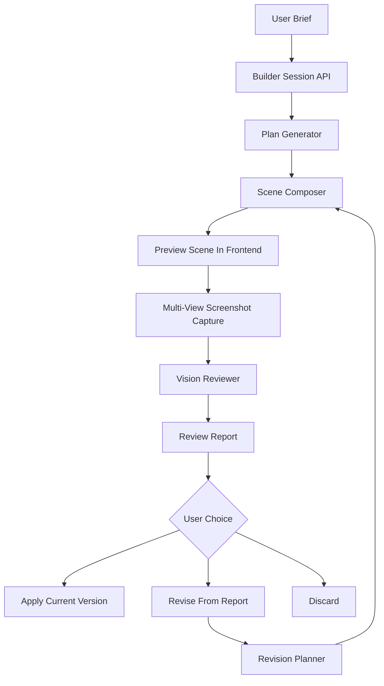

# AI Exhibition Builder Agent Design

## Goal

Upgrade AI exhibition creation from a one-shot generator into an AI Exhibition Builder Agent.

The Builder Agent should generate an exhibition scene, render multiple inspection views, use a vision-language reviewer to assess the actual Three.js output, and present a technical and curatorial review report before the user decides whether to apply or revise the result.

The first version should prioritize multi-view VL inspection over automatic hidden correction. When the Agent finds problems, it shows a report and lets the user choose whether to revise.

## Current Baseline

The existing AI builder lives in the 3D editor's More Tools panel in `src/app/modules/metaverse3d/components/UI/EditUI.tsx`.

Current flow:

1. User enters an exhibition brief, style, and exhibit count.
2. Frontend calls `requestExhibitionScene`.
3. Backend handles `POST /api/ai/exhibition-scene`.
4. `server/services/exhibitionSceneService.js` calls Qwen / DashScope to generate an exhibition plan.
5. Local code converts the plan into a Three.js scene snapshot.
6. User previews the result and applies it through `importScene`.

Known limitations:

- The current tests prove API shape and basic scene creation, but not exhibition quality.
- The builder has no visual self-review step.
- Generated scene quality can degrade into a single-wall layout without narrative spatial rhythm.
- Geometry correctness needs explicit validation because floor items can float and wall-mounted items can intersect wall geometry if placement rules drift.

## Product Direction

The Builder Agent should feel like a virtual exhibition production assistant, not a simple form.

It should:

- Build from a user brief.
- Render the generated scene before final application.
- Capture multiple inspection screenshots.
- Ask a VL reviewer to evaluate what the scene actually looks like.
- Produce a readable review report.
- Let the user decide whether to apply, revise, or discard.
- Keep technical quality and curatorial quality separate.

## Recommended Architecture

Use a true Builder Agent pipeline.



### Agent Modules

`PlanGenerator`

- Uses Qwen / DashScope to generate exhibition title, curatorial statement, sections, and exhibit metadata.
- Does not generate raw 3D coordinates.
- Keeps output language aligned with the request.
- Produces structured JSON.

`SceneComposer`

- Converts a plan into a deterministic scene snapshot.
- Owns room layout, exhibit placement, wall distribution, lighting, floor objects, and section-to-space mapping.
- Reuses `normalizeSceneGeometry` and scene schema validation.
- Should not rely on VL for basic geometry correctness.

`VisionReviewer`

- Receives screenshots and scene metadata.
- Produces technical and curatorial scores.
- Identifies blocking issues, view-specific observations, and suggested fixes.
- Reviews rendered output rather than abstract scene JSON alone.

`RevisionPlanner`

- Converts the review report into a revised scene.
- Can adjust layout, spacing, lighting, object placement, section rhythm, and labels.
- Does not run indefinitely. A builder session allows at most 3 revise attempts.

## Data Flow

The backend handles generation, review parsing, and revision planning. The frontend handles real rendering and screenshot capture because the VL model should review actual Three.js output.

1. User opens the AI Builder panel in the 3D editor.
2. User enters brief, style, exhibit count, and room shape.
3. Frontend calls `POST /api/ai/exhibition-builder/sessions`.
4. Backend creates an initial builder session response:
   - `sessionId`
   - `versionId`
   - `exhibition`
   - `scene`
   - `source`
   - `warnings`
5. Frontend loads the generated scene into a temporary preview state, not the official editor scene.
6. Frontend captures multiple screenshots:
   - entrance overview
   - left wall pass
   - right wall pass
   - center aisle
   - top-down layout
   - closest exhibit detail
7. Frontend calls `POST /api/ai/exhibition-builder/sessions/:id/review` with screenshots and scene metadata.
8. Backend returns a review report.
9. UI shows the report and offers:
   - apply current version
   - revise from report
   - discard
10. If the user chooses revise, frontend calls `POST /api/ai/exhibition-builder/sessions/:id/revise`.
11. Backend returns a new scene version and the frontend repeats the review flow.

## Review Contract

```ts
type ExhibitionBuilderReview = {
  technicalScore: number;
  curatorialScore: number;
  overallStatus: "pass" | "needs_revision" | "blocked";
  blockingIssues: Array<{
    category: "geometry" | "layout" | "lighting" | "navigation" | "curation";
    severity: "low" | "medium" | "high";
    viewId: string;
    message: string;
    suggestedFix: string;
  }>;
  viewReviews: Array<{
    viewId: string;
    label: string;
    observations: string[];
  }>;
  revisionPrompt: string;
};
```

Passing threshold:

- `technicalScore >= 85`
- `curatorialScore >= 75`
- no high-severity technical issue

## Technical Review Criteria

The VL reviewer should inspect:

- Ground objects floating above or sinking into the floor.
- Wall-mounted items intersecting walls, facing the wrong way, or floating too far from the wall.
- Overlapping exhibits, furniture, labels, or light strips.
- Navigation paths blocked by benches, plants, partitions, or dense exhibits.
- Main exhibits too dark or unreadable.
- Camera views failing to reveal the exhibition clearly.
- Multi-room or multi-section briefs not represented spatially.

## Curatorial Review Criteria

The VL reviewer should inspect:

- Exhibition title matches the user brief.
- Sections form a clear narrative.
- Exhibit titles are specific rather than filler such as "Exhibit 1".
- Each section has a distinct rhythm or theme.
- Labels are concrete and readable.
- Requested immersive zones are represented spatially.
- Exhibit count, medium mix, and style match the request.

## UI Design

The current AI Builder panel should become a Builder Agent workspace inside More Tools.

### Brief State

- Exhibition brief textarea.
- Space style.
- Exhibit count.
- Room shape.
- Generate button.

### Generating State

Show step labels:

- planning exhibition
- composing scene
- preparing inspection

Avoid fake progress bars.

### Reviewing State

Show inspection steps:

- capturing entrance overview
- capturing left wall pass
- capturing right wall pass
- capturing center aisle
- capturing top-down layout
- capturing closest exhibit detail
- sending to VL reviewer

### Review Report State

Show:

- technical score badge
- curatorial score badge
- pass / needs revision / blocked status
- severity-sorted issue list
- view label per issue
- readable observations, not raw JSON

Actions:

- Apply current version.
- Revise from report.
- Discard.

### Revised State

- Show the new scene version.
- Allow another VL review.
- Preserve prior version and report so the user can compare and back out.

Important behavior:

- Generated scenes are not applied to the official editor scene until the user clicks apply.
- VL failure should not destroy the generated scene.
- Users can still apply an unreviewed scene, but the UI must label it as not visually inspected.

## Error Handling

Qwen generation failure:

- Return fallback scene.
- Mark `source: "fallback"`.
- Recommend review before applying.

Preview render failure:

- Keep scene JSON.
- Show that visual inspection cannot run.
- Allow discard or manual apply.

Insufficient screenshots:

- Do not send VL request with fewer than 3 screenshots.
- Show "inspection views insufficient" and allow retry.

VL API failure:

- Preserve the generated scene.
- Show visual review failed.
- Allow retry or manual apply.

Revision still low quality:

- Stop after 3 revision attempts.
- Show the latest report and let the user decide.

High-severity technical issue:

- Mark as not recommended to apply.
- Do not hard-block the user.

Timeouts:

- Each pipeline step has its own timeout.
- UI names the stalled step.

## Persistence

First implementation can keep builder sessions in frontend state and use stateless backend review and revise APIs.

Persistent session history is optional and should be added later if needed.

If persistent history is added, store:

- user id
- brief
- version id
- scene JSON
- review report
- created timestamp
- source

Screenshots may contain uploaded user artwork. Do not write screenshots to public paths unless an explicit save feature is added.

## API Sketch

```http
POST /api/ai/exhibition-builder/sessions
```

Request:

```ts
{
  prompt: string;
  language?: "zh-TW" | "zh-CN" | "en";
  style?: ExhibitionSceneStyle;
  exhibitCount?: number;
  roomShape?: "single-room" | "long-gallery" | "multi-room";
  currentScene?: SceneSnapshot | null;
  assets?: Array<{
    title?: string;
    artist?: string;
    description?: string;
    imageUrl?: string;
    type?: "image" | "text" | "model" | "video";
  }>;
}
```

Response:

```ts
{
  sessionId: string;
  versionId: string;
  exhibition: ExhibitionSceneResponse["exhibition"];
  scene: SceneSnapshot;
  source: "qwen" | "fallback";
  warnings: string[];
  status: "generated";
}
```

```http
POST /api/ai/exhibition-builder/sessions/:sessionId/review
```

Request:

```ts
{
  versionId: string;
  scene: SceneSnapshot;
  screenshots: Array<{
    viewId: string;
    label: string;
    dataUrl: string;
  }>;
}
```

Response:

```ts
{
  sessionId: string;
  versionId: string;
  review: ExhibitionBuilderReview;
  status: "reviewed";
}
```

```http
POST /api/ai/exhibition-builder/sessions/:sessionId/revise
```

Request:

```ts
{
  versionId: string;
  scene: SceneSnapshot;
  review: ExhibitionBuilderReview;
  prompt?: string;
}
```

Response:

```ts
{
  sessionId: string;
  versionId: string;
  exhibition: ExhibitionSceneResponse["exhibition"];
  scene: SceneSnapshot;
  source: "qwen" | "fallback";
  warnings: string[];
  revisionCount: number;
  status: "revised";
}
```

## Testing Strategy

Backend unit tests:

- Plan generator returns exact exhibit count.
- Plan generator falls back when Qwen output is invalid.
- Scene composer distributes exhibits across meaningful wall or room areas.
- Scene composer keeps floor items grounded.
- Scene composer keeps wall-mounted items clear of wall geometry.
- Vision reviewer parses VL output into a stable review report.
- Vision reviewer maps low scores or high-severity issues to `needs_revision`.
- Revision planner converts report issues into scene changes.
- Session orchestrator enforces the 3-revision limit.

Frontend tests:

- Builder workspace renders each pipeline state.
- Generated scene is not applied until the user clicks apply.
- Screenshot capture requires at least 3 views before review.
- Review report shows both technical and curatorial scores.
- Revise button calls the revise API with the latest review.
- VL failure leaves the generated scene available but labeled unreviewed.

Manual verification:

- Generate Macau city memory exhibitions with 6 and 12 exhibits.
- Confirm multi-view screenshots include overview, side passes, top-down, and detail.
- Inject an obvious floating object and verify VL flags it.
- Inject a wall intersection and verify VL flags it.
- Confirm revision reduces blocking issues or raises scores.

## Out of Scope For First Version

- Fully autonomous hidden multi-round correction.
- Permanent screenshot storage.
- Full browser-side visual diff UI.
- Real-time streaming progress from backend.
- Replacing the existing Agent guide.
- Building a full 3D pathfinding evaluator.

## Definition Of Done

- User can generate a scene through the Builder Agent workspace.
- The generated scene is previewed but not applied automatically.
- The frontend captures at least 6 inspection views.
- The backend returns a parsed VL review report.
- The UI shows technical score, curatorial score, status, observations, and issues.
- User can apply, revise, or discard.
- Revision returns a new scene version.
- Geometry tests protect against floating floor items and wall intersections.
- Existing AI builder tests continue to pass.
