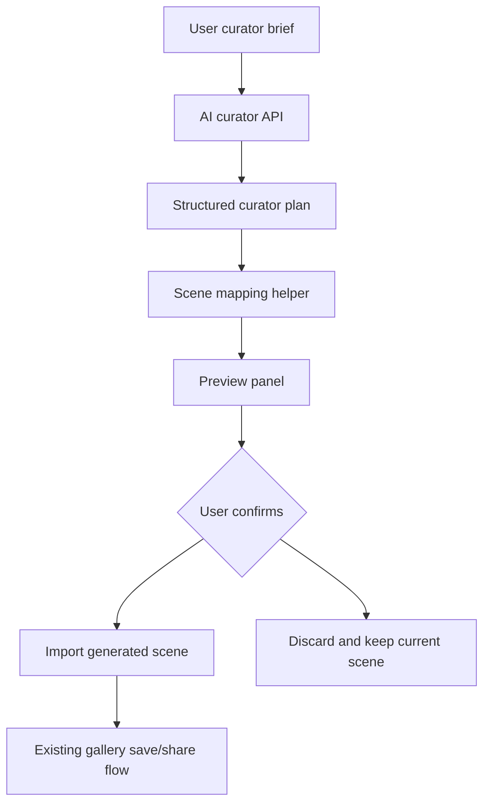

# AI Curator V1 Design

## Goal

Build a focused AI curator assistant for the virtual gallery creator. The first version should help a creator turn a short exhibition idea into a usable 3D gallery draft: title, intro, sections, exhibit labels, guide opening script, and a deterministic starter layout that can be previewed and applied to the existing editor scene.

This is deliberately smaller than the existing AI Exhibition Builder Agent design. V1 does not perform visual inspection, screenshot review, or autonomous revision. It creates a reliable first draft that makes the gallery editor feel faster and more complete.

## Current Baseline

The application already has:

- A Vite + React 18 gallery creator at `src/app/pages/VirtualGalleryCreate.tsx`.
- A metaverse studio facade under `src/app/features/metaverse-studio/`.
- The legacy 3D editor, store, scene import/export, and item model under `src/app/modules/metaverse3d/`.
- AI writing endpoints under `server/routes/aiWritingRoutes.js` and `server/services/aiWritingService.js`.
- Exhibition scene generation endpoints under `server/routes/exhibitionSceneRoutes.js` and `server/services/exhibitionSceneService.js`.
- Gallery persistence and sharing through the gallery APIs.
- Agent, TTS, visitor memory, and multiplayer foundations that can be reused by later versions.

The key product gap is that users still need to manually assemble a convincing exhibition. The editor has strong primitives, but the first blank state can feel heavy.

## Product Scope

AI Curator V1 adds a guided generation panel inside the gallery creator. The user enters:

- Exhibition theme.
- Optional style or atmosphere.
- Target audience.
- Desired exhibit count.
- Language.

The system returns:

- Exhibition title.
- Curatorial introduction.
- Three to five sections.
- Exhibit suggestions with title, short description, medium, and section.
- A guide opening script.
- A deterministic starter scene made from existing supported scene items.

The user can preview the generated plan, apply it to the current 3D scene, then save through the existing gallery flow.

## Recommended Approach

Use a thin end-to-end AI curator pipeline:



This approach is recommended because it uses existing services, editor state, and gallery persistence. It also creates a strong visible product improvement without introducing the complexity of visual self-review.

## Architecture

### Frontend

Add an AI curator workspace to the existing 3D editor UI, preferably inside the current tools or side panel pattern used by the metaverse editor.

The workspace has four states:

1. `brief`: input fields and generate action.
2. `generating`: named loading state, no fake progress bar.
3. `preview`: structured plan and apply/discard actions.
4. `error`: readable failure with retry and fallback guidance.

The frontend owns:

- Form state and validation.
- Calling the AI curator API.
- Rendering the plan preview.
- Converting accepted output into `importScene`.
- Preserving the current scene until the user confirms apply.

### Backend

Add a focused AI curator route rather than overloading general writing routes.

Suggested route:

```http
POST /api/ai/curator-plan
```

The route requires auth, uses the existing AI writing rate limiter, validates request shape with Zod, and delegates generation to a service helper.

The backend owns:

- Request validation.
- Qwen/DashScope call.
- JSON extraction and schema validation.
- Fallback plan when no API key is configured or the model returns invalid output.
- Stable response format.

### Shared Mapping

Create a pure frontend helper that maps the curator response to a scene snapshot. Keep this mapping deterministic and tested.

Initial mapping rules:

- Use the existing default room dimensions unless the current scene has a room.
- Place section intro text panels along the back or side walls.
- Place exhibit placeholders in a balanced wall sequence.
- Use text exhibit items when no uploaded artwork is provided.
- Add a small number of light strips or partitions only if supported by existing item types.
- Keep all generated object IDs stable enough for tests, but unique enough for runtime use.

Avoid asking the model for raw coordinates. The model should produce curatorial structure; local code should own geometry.

## API Contract

Request:

```ts
type CuratorPlanRequest = {
  theme: string;
  style?: string;
  audience?: string;
  language?: "zh-TW" | "zh-CN" | "en";
  exhibitCount?: number;
};
```

Validation:

- `theme`: required, 1 to 500 characters.
- `style`: optional, max 120 characters.
- `audience`: optional, max 120 characters.
- `language`: optional, defaults to `zh-TW`.
- `exhibitCount`: optional, integer from 3 to 12, defaults to 6.

Response:

```ts
type CuratorPlanResponse = {
  source: "qwen" | "fallback";
  exhibition: {
    title: string;
    introduction: string;
    guideOpening: string;
    sections: Array<{
      id: string;
      title: string;
      summary: string;
    }>;
    exhibits: Array<{
      id: string;
      sectionId: string;
      title: string;
      description: string;
      medium: "image" | "text" | "model" | "video" | "mixed";
      placementHint: "left-wall" | "right-wall" | "back-wall" | "center";
    }>;
  };
  warnings: string[];
};
```

The service must normalize model output so the client receives the exact requested exhibit count whenever possible. If normalization cannot recover a valid plan, return a fallback plan with `source: "fallback"` and a warning.

## UI Behavior

The panel should feel like a working tool, not a marketing feature.

Brief form:

- Theme textarea.
- Style select or short input.
- Audience input.
- Exhibit count stepper or select.
- Language select.
- Generate button.

Preview:

- Title and introduction.
- Section list.
- Exhibit list grouped by section.
- Guide opening script.
- Apply to gallery button.
- Discard button.

Apply behavior:

- Do not mutate the scene during preview.
- When the user applies, import the mapped scene through the existing store action.
- Show a toast that the draft has been applied.
- Existing autosave/save behavior handles persistence.

Error behavior:

- Model/API failure should show retry.
- Missing API key should still return a fallback plan.
- Invalid model JSON should not reach the client as raw text.
- The user should never lose the current editor scene because generation failed.

## Data Flow

1. User opens the gallery creator.
2. User opens AI Curator.
3. User submits the brief.
4. Frontend calls `POST /api/ai/curator-plan`.
5. Backend validates input and asks the model for structured JSON.
6. Backend validates and normalizes output.
7. Frontend shows the preview.
8. User applies the plan.
9. Frontend maps plan to a scene snapshot and calls `importScene`.
10. Existing gallery save/autosave persists the result.

## Testing Strategy

Backend tests:

- Route rejects missing theme.
- Route clamps or rejects invalid exhibit count.
- Service fallback works without API key.
- Service parses valid model JSON.
- Service recovers from invalid model JSON by returning fallback.
- Response contains the requested number of exhibits when valid.

Frontend tests:

- AI curator panel renders the brief form.
- Generate button is disabled for empty theme.
- Successful response renders title, sections, exhibits, and guide script.
- Error response shows retry without applying a scene.
- Apply action calls the scene import path only after confirmation.

Pure mapping tests:

- Curator plan maps to supported scene item types.
- Generated items fit inside the default room bounds.
- Exhibit placeholders distribute across wall placement hints.
- Mapping is deterministic for the same plan.

Manual verification:

- Generate a Macau intangible cultural heritage exhibition with 6 exhibits.
- Generate a school graduation project exhibition with 10 exhibits.
- Confirm the current scene is unchanged before apply.
- Confirm apply produces visible text/exhibit placeholders in the 3D editor.
- Save and reopen the generated gallery.

## Out Of Scope

- Vision-language review of rendered screenshots.
- Multi-step autonomous revision.
- Streaming generation.
- Permanent AI generation history.
- Upload-aware artwork analysis.
- Visitor question-answering inside the generated gallery.
- Billing, quotas, or admin analytics.

These are good next steps after the V1 curator path is stable.

## Definition Of Done

- Authenticated users can generate a curator plan from the gallery creator.
- The backend returns validated structured curator data with fallback behavior.
- The frontend previews the plan before mutating the 3D scene.
- Applying the plan imports a deterministic starter scene.
- Existing save/autosave/share flows continue to work.
- Focused backend, frontend, and mapping tests cover the new behavior.
